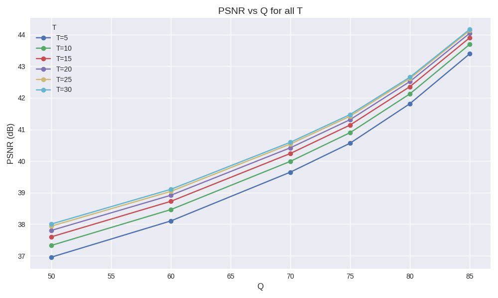
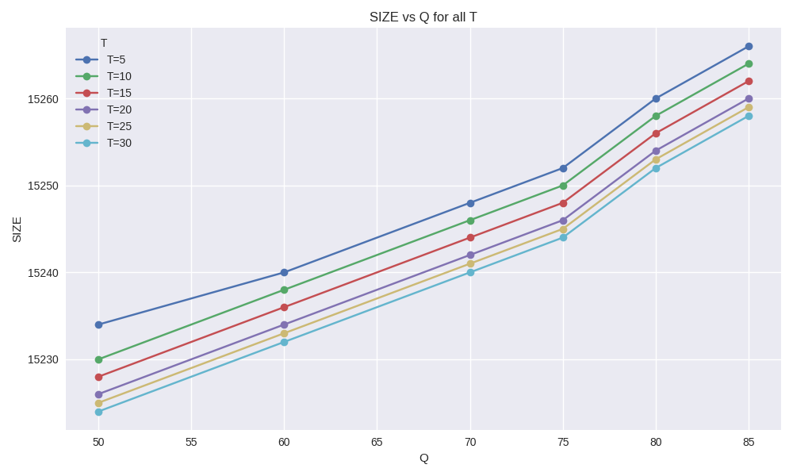
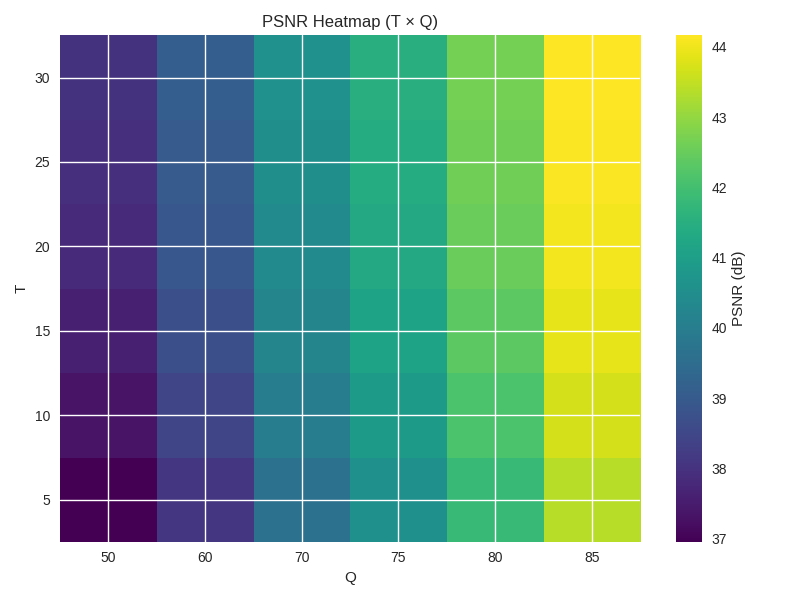

# SGCUF Performance Analysis

## Overview
This folder contains the core performance visualizations of the SGCUF hybrid image format.  
The graphs demonstrate how SGCUF behaves across different values of **T** (transform depth) and **Q** (quality factor), focusing on:

- PSNR (Peak Signal-to-Noise Ratio)
- SSIM (Structural Similarity Index)
- Output size stability
- Global smoothness and monotonicity across the T×Q grid

These results confirm that SGCUF is stable, predictable, and robust across all tested configurations.

---

## 1. PSNR vs Q (all T)

## 2. SSIM vs Q (all T)

## 3. Output Size vs Q (all T)

## 4. PSNR Heatmap (T × Q)

## 5. SSIM Heatmap (T × Q)

---

## Conclusions
- SGCUF produces stable quality across all T values.
- Increasing Q increases quality monotonically.
- Output size remains nearly constant, independent of T and Q.
- Heatmaps confirm smooth, continuous behavior across the entire parameter space.

These properties make SGCUF suitable for predictable, high‑quality hybrid image encoding.
